# 高翠网 · AI 翡翠匹配平台

> 面向翡翠买卖撮合的 AI 找货平台。买家用自然语言找货，商家通过后台发布货源、管理客资、接收通知，形成从需求到成交线索的完整闭环。

<p align="center">
  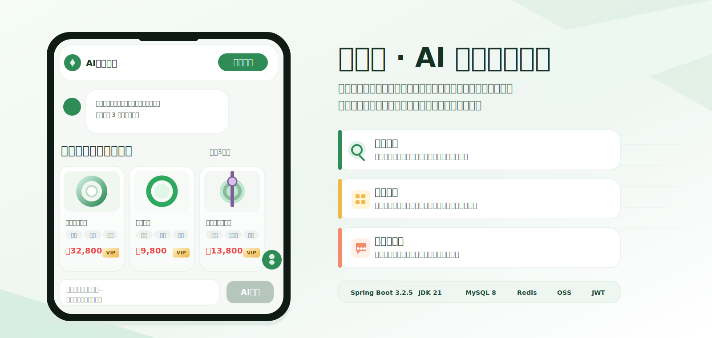
</p>

---

## 📱 效果预览（真实运行截图）

以下均为项目本地真实运行后截取的界面，未做任何 UI 修饰。

### 🛒 买家端 · AI 找货（游客可用）

<table>
  <tr>
    <td width="33.3%" align="center"><b>① AI 找货首页</b><br/>自然语言对话 + 预设需求词</td>
    <td width="33.3%" align="center"><b>② AI 匹配结果</b><br/>大模型语义召回并返回 3 张货源卡片</td>
    <td width="33.3%" align="center"><b>③ 商品详情</b><br/>实物图 / 价格 / 标签 / 联系卖家留资</td>
  </tr>
  <tr>
    <td align="center">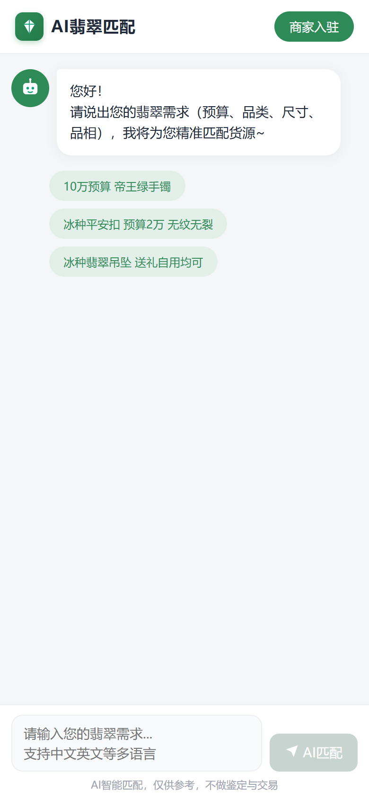</td>
    <td align="center">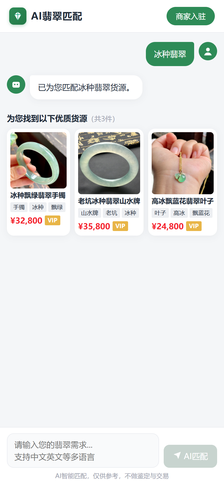</td>
    <td align="center">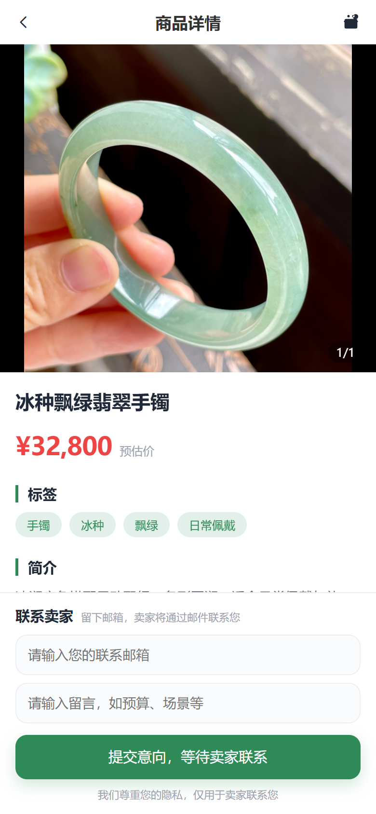</td>
  </tr>
</table>

### 🏪 商家后台（登录后）

<table>
  <tr>
    <td width="25%" align="center"><b>数据面板</b><br/>上架数 / 额度 / 客资统计</td>
    <td width="25%" align="center"><b>商品管理</b><br/>上下架 / 草稿 / 编辑 / 删除</td>
    <td width="25%" align="center"><b>客资列表</b><br/>买家留资（分层脱敏）</td>
    <td width="25%" align="center"><b>系统通知</b><br/>新客资 / VIP 到期提醒</td>
  </tr>
  <tr>
    <td align="center">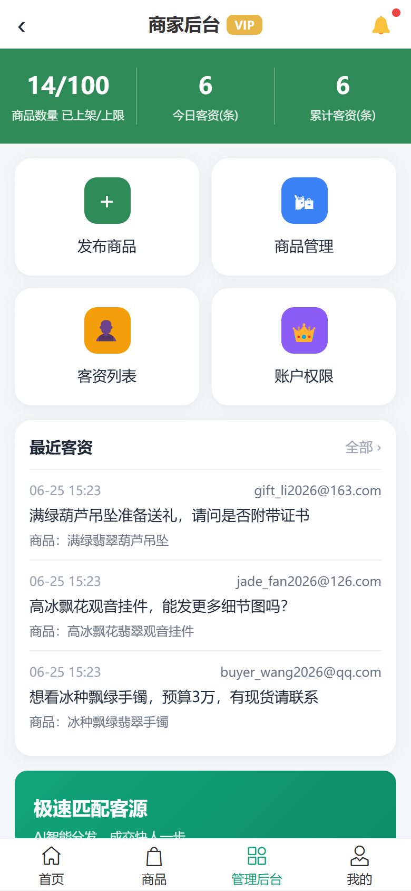</td>
    <td align="center">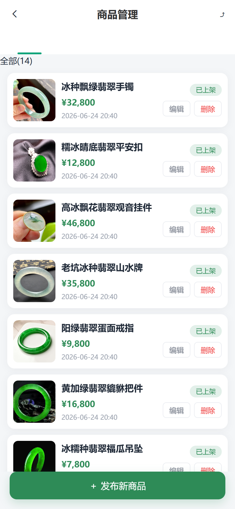</td>
    <td align="center">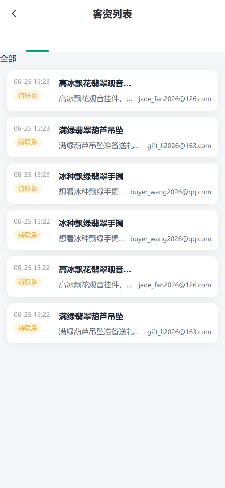</td>
    <td align="center">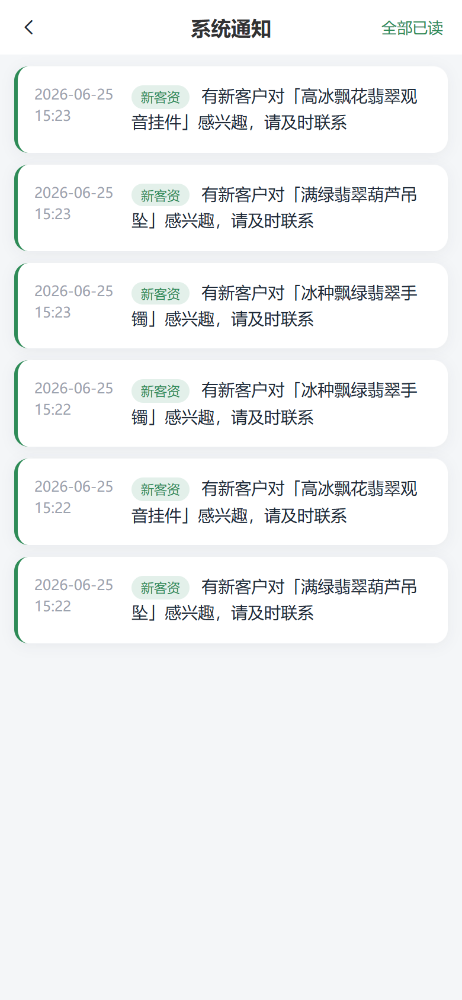</td>
  </tr>
</table>

<details>
<summary>📷 查看更多界面（发布商品 / 客资详情 / 个人中心）</summary>

<table>
  <tr>
    <td width="33.3%" align="center"><b>发布商品</b><br/>图片上传 + AI 图片转文案</td>
    <td width="33.3%" align="center"><b>客资详情</b><br/>买家邮箱 / 留言 / 标记已联系</td>
    <td width="33.3%" align="center"><b>个人中心</b><br/>层级 / 发布额度 / 通知设置</td>
  </tr>
  <tr>
    <td align="center">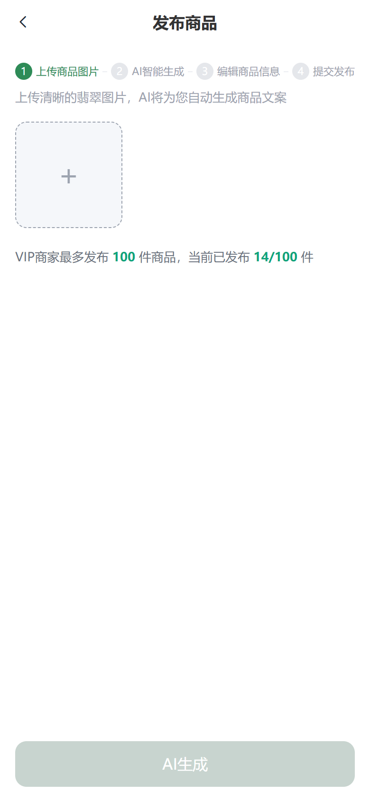</td>
    <td align="center">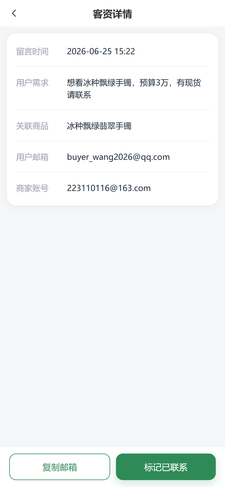</td>
    <td align="center">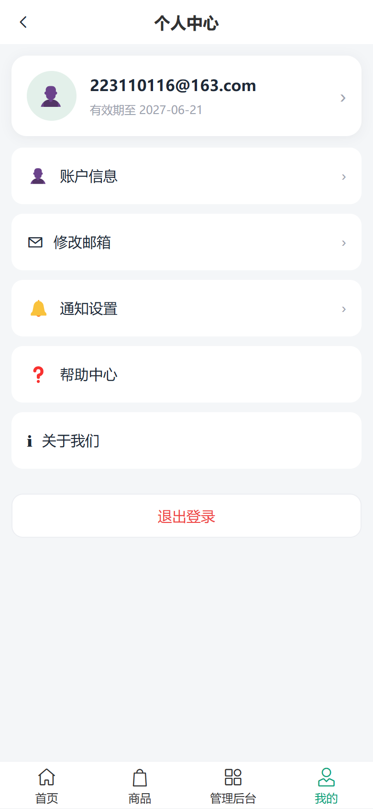</td>
  </tr>
</table>
</details>

---

## ✨ 项目亮点

- **AI 找货**：买家用自然语言描述需求，向量库语义召回候选商品，再由大模型综合排序并返回 3 张匹配翡翠卡片。
- **商家后台**：商品发布、上下架、客资查看、通知管理一套打通。
- **图片转文案**：上传商品图片，视觉大模型自动生成标题、简介、详情和标签。
- **分层体系**：FREE / VIP 的发布额度、邮箱脱敏、到期提醒。
- **性能与可靠性**：Redis 缓存（AI 结果 + 商品详情）、向量库持久化与增量更新、AI 匹配异步化 + 独立线程池隔离 + 超时兜底。

## 🧰 技术栈

| 类别 | 选型 |
|---|---|
| 框架 | Spring Boot 3.2.5 + JDK 21 |
| 持久层 | MyBatis-Plus 3.5.7 + MySQL 8 |
| AI | LangChain4j 1.0.1 + 阿里 DashScope（Qwen-Plus 文本 / Qwen-VL-Max 视觉） |
| 向量召回 | DashScope Embedding + 本地向量库（持久化 / 增量更新） |
| 缓存 | Redis（商品详情 `@Cacheable` / AI 结果手动缓存） |
| 存储 | 阿里云 OSS（商品图片） |
| 鉴权 | JWT（com.auth0:java-jwt） |
| 文档 | Knife4j（OpenAPI 3） |
| 前端 | Vue 3 + Vite + Pinia + Vant 4 |

## 📂 仓库结构

```
FEICUI/
├── feicui-backend/      后端服务 (Spring Boot) — API / 配置 / 部署
│   └── src/main/java/com/gaocui/
│       ├── FeicuiApplication.java        启动类
│       ├── common/                       统一响应 / 异常 / JWT / 拦截器 / OSS / 配置
│       └── modules/
│           ├── auth/         邮箱验证码登录注册
│           ├── merchant/     商家资料 / 面板 / 通知设置 / 分层
│           ├── product/      商品 CRUD / 上下架 / 额度 / 管理列表
│           ├── lead/         客资提交 / 列表 / 详情 / 脱敏
│           ├── ai/           找货匹配 + 图片转文案
│           ├── notify/       系统通知 + VIP 到期定时任务
│           └── home/         游客公开接口 (商品详情 / 留资 / AI 匹配)
└── feicui-h5/           移动端 H5 前台 (Vue 3)
```

## 🚀 快速启动

> 前置：JDK 21、Maven、MySQL 8、Redis、Node 18+ / pnpm。

1. **建库**：执行 `feicui-backend/src/main/resources/db/schema.sql`（创建 `gaocui` 库与业务表）。
2. **改配置**：复制 `application-dev.yml.example` 为 `application-dev.yml`，填入：
   - `spring.datasource` 数据库账号密码
   - `oss.*` 阿里云 OSS（endpoint / bucket / AK / SK / domain）
   - `dashscope.api-key` 阿里 DashScope API Key
3. **启动后端**：`mvn spring-boot:run`，接口文档 `http://localhost:8080/api/doc.html`。
4. **启动前端**：
   ```bash
   cd feicui-h5
   pnpm install
   pnpm dev      # http://localhost:5173
   ```

> 验证码开发期直接**控制台打印**（`gaocui.verify-code.dev-print=true`），无需真实邮箱。

## 🔌 核心 API

### 鉴权 `/auth`、游客 `/home`（无需登录）
| 方法 | 路径 | 说明 |
|---|---|---|
| POST | `/auth/send-code` | 发送邮箱验证码（开发期控制台打印） |
| POST | `/auth/login` | 邮箱验证码登录 / 注册（二合一），返回 JWT |
| POST | `/home/ai/match` | AI 找货匹配（解析需求 → 3 张翡翠卡片） |
| GET | `/home/products/{id}` | 商品详情（仅已上架） |
| POST | `/home/products/{id}/lead` | 提交客资（留邮箱 + 留言） |

### 商家后台 `/merchant/**`（需 `Authorization: Bearer <token>`）
| 方法 | 路径 | 说明 |
|---|---|---|
| GET | `/merchant/dashboard` | 数据面板（上架数 / 上限、今日 / 累计客资） |
| GET | `/merchant/profile` | 个人中心资料（层级、发布上限） |
| POST | `/merchant/products/upload-image` | 上传图片到 OSS |
| POST | `/merchant/products/ai-generate` | AI 图片转文案（Qwen-VL） |
| POST/PUT/DELETE | `/merchant/products/**` | 商品创建 / 编辑 / 上下架 / 删除 / 列表 |
| GET | `/merchant/leads` | 客资列表（FREE 邮箱脱敏） |
| PUT | `/merchant/leads/{id}/contacted` | 标记已联系 |
| GET | `/merchant/notifications` | 通知列表 / 未读数 / 标记已读 |

## 📐 业务规则要点

- **分层**：FREE 发布上限 2 件、客资邮箱脱敏；VIP 上限 100 件、邮箱可见。VIP 过期自动降级展示。
- **商品状态机**：DRAFT（草稿）→ LISTED（已上架）↔ DELISTED（已下架），上架前校验额度。
- **客资**：游客在商品详情留邮箱 + 留言，进入该商品所属商家；FREE 看脱敏邮箱。
- **通知**：新客资自动生成站内通知；每天 09:00 扫描 30 天内到期 VIP 并提醒（去重）。

## 📌 URL 鉴权约定

- `/auth/**`、`/home/**`、`/files/**`：游客可访问（无需登录）
- `/merchant/**`：需在请求头携带 `Authorization: Bearer <token>`

---

<p align="center">
  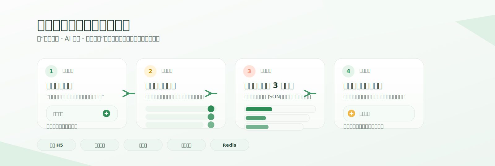
</p>
